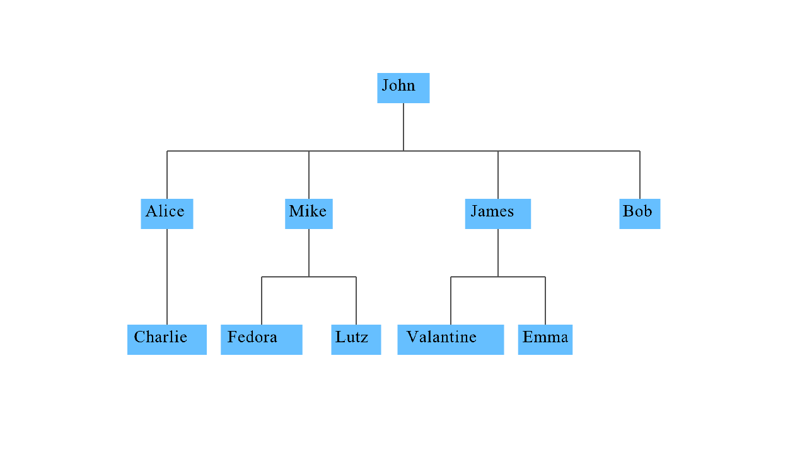

# graph-visualizer
generates a graph based on parent-child relationship from a csv file
## Screenshot

## Usage
input data in the csv file in this format
```csv
Parent,child1,child2,child3,etc...
```
parents can be repeated and still be recognized as one entity for example
```csv
John,child1
John,child2
```
is equivalent to
```csv
John,child1,child2
```

consequently you can navigate with the keyboard arrow keys
